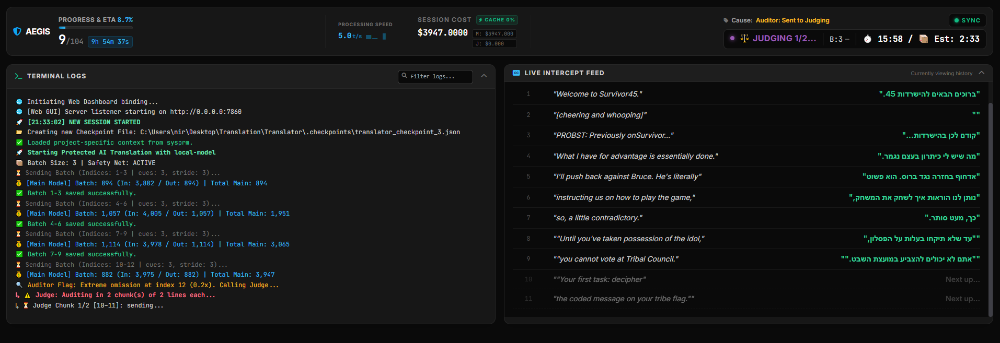
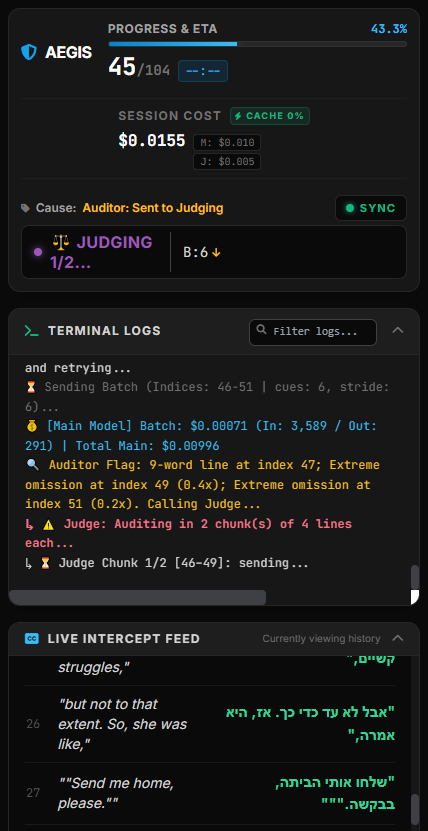

# 🛡️ Aegis AI Subtitles
### The Guardian of Subtitle Translation Quality


**Aegis AI Subtitles** is a professional-grade translation engine designed to bridge the gap between English and Hebrew with surgical precision. Unlike standard translators, Aegis employs a multi-layered "Shield" architecture featuring automated auditing and AI-driven quality assurance to ensure every line is natural, accurate, and perfectly formatted.

### 🔍 Interactive Monitoring
With the built-in **Live Viewer**, you can audit the translation process in real-time, comparing the English source directly against the Hebrew output.


---

## 🚀 Key Features

- **🧠 Context-Aware Translation**: Processes subtitles in overlapping batches using a **Sandwich Architecture** (Thought -> Summary -> Work -> Metadata) to maximize model focus and narrative continuity.
- **⚖️ AI Judge System**: A dedicated "Judge" model semantically verifies suspicious translations, detecting hallucinations, omissions, and cultural nuances.
- **🛡️ Forensic Auditor**: A high-speed heuristic scanner that enforces strict SDH removal, RTL formatting, and dynamic speaker name deletion. It now features **Hyper-Specific Error Reporting**, extracting and naming exact offending words (e.g., `"stuck"`, `"Z"`) to help the LLM correct hallucinations during retries.
- **🩹 Self-Healing & Resilience**: Path-breaking schema inference that recovers translations from hallucinated JSON keys—optimized specifically for high-reasoning models like GPT-5/o1.
- **💰 Cost-Optimized**: Native support for prompt caching (GPT-5, DeepSeek 90% discount) with real-time token tracking and hit-ratio logs.
- **🔄 Hot Resume**: Seamlessly stop, tune parameters (batch sizes, models), and resume without losing session history.
- **🚀 Flight Control Dashboard**: Real-time diagnostic header featuring:
  - **⏱️ Live Response Timers**: Precise `M:SS` tracking for model deliberation.
  - **📈 Linear Regression Estimation**: A "Clever Countdown" that learns from history to predict completion times.
  - **🔄 Dual-Track Analytics**: Separate performance modeling for "New" vs "Retry" batches.
  - **⚖️ Audit Progress**: Live chunk-tracking (e.g., `Judging 1/3...`) during the QA phase.
  - **🔼 Adaptive Scaling**: Visual indicators for automatic batch-size growth or shrinking.
- **🌐 Web Dashboard (V3 Command Center)**: A full-featured remote monitoring console accessible from any device on your local network.
  - **📊 Live Telemetry Topbar**: Real-time tokens/sec with a sparkline chart, cache hit %, session cost (Main + Judge split), batch size with ↑↓ trend indicators, and a live timer.
  - **🏷️ Cause Indicator**: Shows exactly why the current batch is running — `✦ Fresh Batch`, `Auditor: Failed & Retry`, `Judge: Failed & Retry`, `⚠️ Parse Error: Retry`, etc.
  - **🖥️ Side-by-Side Desktop Layout**: Terminal Logs and Live Intercept Feed panels sit side by side on desktop for maximum information density, stacking vertically on mobile.
  - **🔍 Filterable Terminal**: Searchable, syntax-highlighted log terminal with emoji-keyed colour coding.
  - **🎬 Live Intercept Feed**: Paginated English ↔ Hebrew grid with auto-scroll and 50-segment resume history.
  - **📱 Responsive Mobile View**: Compact stacked layout optimised for phone screens without losing any telemetry.
- **📋 Clipboard Integration**: Instantly copy terminal output logs with a single button click in the main dashboard.
- **⚡ Engine Performance**: Drastically reduced CPU footprint and memory allocation during heavy iteration loops via centralized regex compilation mapping and class-method delegate abstraction.
- **🖥️ Local Model Support**: Optimized for LM Studio and local LLMs via **API-level Strict Mode** (JSON Schema enforcement). The engine automatically synchronizes and deduplicates the `required` keys in the schema, ensuring 100% structural stability and preventing `400 Bad Request` errors even on smaller hardware.
  > [!IMPORTANT]
  > **LM Studio Users**: You must enable the **"Structured Output"** toggle in LM Studio's Inference settings for the system's Strict Mode to function correctly.

---

## 📦 Dependencies

Aegis relies on the following external Python libraries for AI model connectivity:

- **Google Generative AI SDK**: `google-generativeai`
- **OpenAI SDK**: `openai` (used for OpenAI, DeepSeek, and local LM Studio instances)

You can install all dependencies with a single command:
```bash
pip install -r requirements.txt
```

---

## 🌐 Remote Monitoring (Web Dashboard)

Aegis includes a built-in web server that allows you to monitor your translation sessions from your phone or any local device.

### Desktop View


### Mobile View (Messenger Style)


To access the dashboard:
1. Ensure your phone/device is on the same local network (Wi-Fi).
2. Find your computer's local IP address (e.g., `192.168.1.XXX`).
3. Open `http://YOUR_IP:7860` in your browser.

> [!TIP]
> **Firewall Configuration**: If you can't connect, ensure that your PC's firewall (e.g., Windows Defender) is set to allow incoming connections on port **7860**. You may need to add an "Inbound Rule" for your Python installation or explicitly open this port.

---

## 🛠️ Installation & Usage

### Prerequisites
- Python 3.10+
- A valid API key for OpenAI, DeepSeek, or Google Gemini.

### Quick Start
1. Clone the repository.
2. **Setup Directories**:
   - `English subtitles/`: Place your source `.srt` files here.
   - `sysprm files/`: Place your project instructions here (e.g., `survivor_45_hebrew.sysprm`). Aegis now supports a **Strict Zero-English Policy** for local models; see the provided templates for Section 7 examples.
3. **Run Application**:
   ```bash
   python translator_ai.pyw
   ```
4. **Configuration**: Click the **⚙️ Settings** button to enter API keys and manage model parameters directly in the UI.

---

## 📖 Under the Hood

### 1. The Context Layer
Aegis doesn't translate in a vacuum. It maintains a rolling history of the "Story So Far," including character bios, current setting, and immediate preceding dialogue to prevent gender-flips and continuity errors. Furthermore, it employs a **Dynamic Prompt Architecture** that automatically synchronizes project-specific custom `.sysprm` dictionaries with global rules, creating a seamlessly numbered instruction set that maximizes LLM adherence.

### 2. The Heuristic Shield
A deterministic auditor that runs before any AI check. It instantly catches "leaks" (like speaker names `JEFF:`) or lines that are physically too long for subtitle screens. During retries, it injects the **exact offending word** into the feedback loop, effectively "shaming" the model into compliance and overcoming stubborn cultural slang (like "Gen Z" hallucinations).

### 3. Reasoner Optimization
Specialized handling for "Reasoning" models (GPT-5/o1). Aegis utilizes the `developer` role to isolate instructions from content, ensuring **90%+ cache hit ratios** and preventing "Schema Collapse" even when the model goes off-script.

---

## 📚 Technical Documentation
- **[System Overview](system_overview.md)**: Deep dive into the architecture and resilience features.
- **[Logging Audit](logging_audit.md)**: Comprehensive guide to terminal and diagnostic log signatures.
