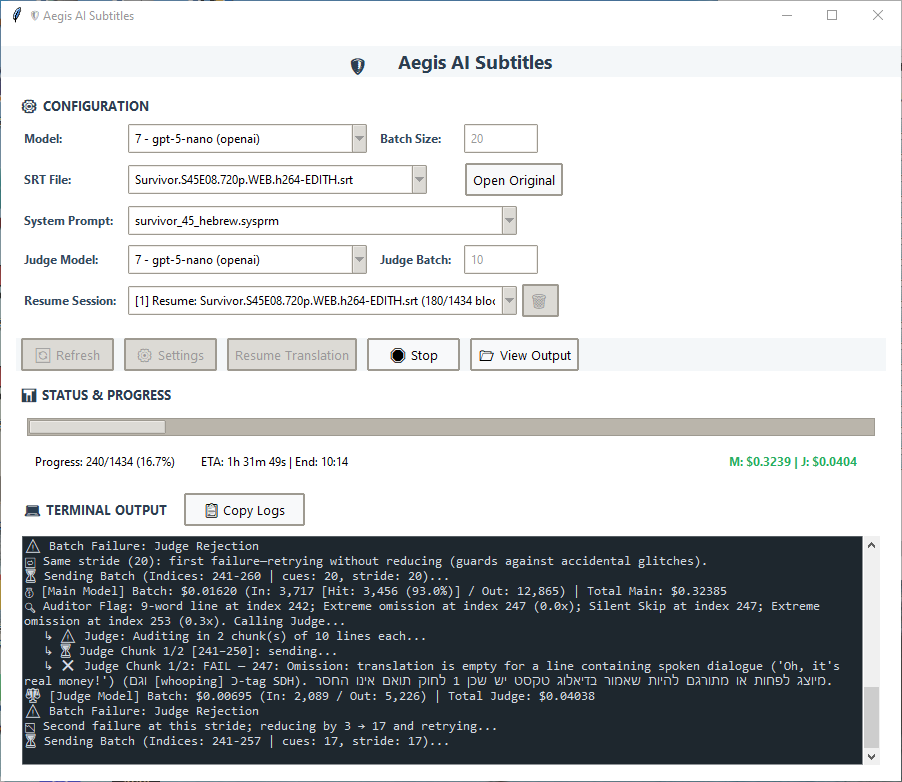
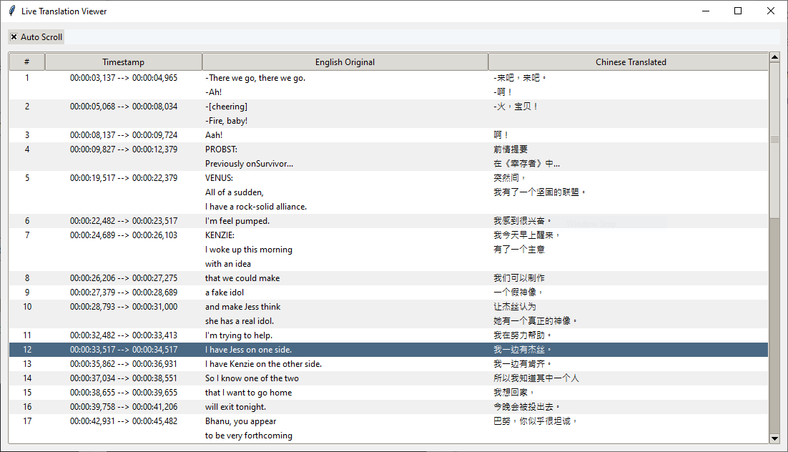

# 🛡️ Aegis AI Subtitles
### The Guardian of Subtitle Translation Quality



**Aegis AI Subtitles** is a professional-grade universal translation engine designed to bridge language gaps with surgical precision. Unlike standard translators, Aegis employs a multi-layered "Shield" architecture featuring automated auditing and AI-driven quality assurance to ensure every line is natural, accurate, and perfectly formatted across any language pair.

### 🔍 Interactive Monitoring
With the built-in **Live Viewer**, you can audit the translation process in real-time, comparing the source text directly against the target language output.



---

## 🚀 Key Features

- **🌐 Universal Language Support**: Supports any source/target language pair. Built-in profiles include Hebrew, Arabic, French, Spanish, Chinese (CJK), German, and more.
- **🧠 Context-Aware Translation**: Processes subtitles in overlapping batches using a **Sandwich Architecture** (Thought -> Summary -> Work -> Metadata) to maximize model focus and narrative continuity.
- **⚖️ AI Judge System**: A dedicated "Judge" model semantically verifies suspicious translations, detecting hallucinations, omissions, and language leakage.
- **✨ Offline Senior Editor**: An advanced offline proofreading suite. Once translation is done, audit your SRT with heavyweight LLMs to catch rare cultural idioms and glossary violations via a beautiful, interactive side-by-side review board.
- **🛡️ Heuristic Auditor**: A high-speed deterministic scanner that enforces line-length constraints, SDH removal, and dynamic speaker name deletion. It automatically adjusts between **word-based** and **character-based (CJK)** counting.
- **🩹 Self-Healing & Resilience**: Path-breaking schema inference that recovers translations from hallucinated JSON keys—optimized specifically for high-reasoning models like GPT-5/o1.
- **💰 Cost-Optimized**: Native support for prompt caching (GPT-5, DeepSeek 90% discount) with real-time token tracking, hit-ratio logs, and reasoning-load metrics.
- **🔄 Hot Resume**: Seamlessly stop, tune parameters (batch sizes, models), and resume without losing session history—powered by a robust checkpointing system.
- **🌐 Web Dashboard (V3 Command Center)**: A full-featured remote monitoring console accessible from any device on your local network.
- **🏗️ Modular Architecture**: Fully refactored for the GPT-5 era, with decoupled core logic, auditing, and UI layers for maximum stability and speed.

---

## 📦 Dependencies

Aegis relies on the following external Python libraries:
- **Google Generative AI SDK**: `google-generativeai`
- **OpenAI SDK**: `openai` (used for OpenAI, DeepSeek, and local LM Studio instances)

Install all dependencies:
```bash
pip install -r requirements.txt
```

---

## 🛠️ Installation & Usage

### Quick Start
1. Clone the repository.
2. **Setup Directories**:
   - **Source Directory**: Place your source `.srt` files in a folder named `<Language> subtitles/`. The language name must match one of the supported profiles below.
     *   *Example: `English subtitles/`, `French subtitles/`, `Chinese subtitles/`*
   - **System Params**: Place your project JSON instructions in the `sysprm files/` folder (See the **[Aegis SysPrm Guide](docs/SYSPRM_GUIDE.md)**).
   - **Translated Output**: The engine automatically creates an output folder named `Translated <Target> subtitles/` (e.g., `Translated Hebrew subtitles/`).

**Supported Language Names (Case Sensitive):**
English, Hebrew, Arabic, French, Spanish, German, Chinese, Portuguese, Russian, Italian, Polish, Ukrainian.
3. **Run Application**:
   ```bash
   python translator_ai.pyw
   ```
4. **Configuration**: 
   - Select **Source** and **Target** languages.
   - **SysPrm**: Select your project file. If you haven't created one yet, click the **🪄 (Magic Wand)** button next to the dropdown to launch the **Prompt Generator**.
   - Select your **Model**.
   - Click **🚀 Start**.

---

## 📖 Under the Hood

### 1. Modular Architecture
Aegis is built on a decoupled architecture where the **Translation Engine** (`core/`) is isolated from the **User Interface** (`ui/`) and **External Services** (`services/`). Extracted single-responsibility submodules inside the `core/translation/` package isolate context resolution, prompting, response processing, initial session initialization (`pipeline_initializer.py`), intervention management (`intervention_handler.py`), and loop state mechanics. This allows for high-performance multi-threading and ensures the UI remains responsive even during heavy LLM processing.

### 2. Language Profiles
Aegis uses a dynamic profile system (`core/language_profiles.py`) that automatically handles RTL (Right-to-Left) text, Unicode ranges, and linguistic density ratios. CJK languages (Chinese, Japanese) use character-based auditing to ensure perfect subtitle pacing.

### 3. The Heuristic Shield
A deterministic auditor (`core/audit_manager.py` & `core/text_processing.py`) that runs before any AI check. It catches "leaks" (like speaker names `JEFF:`) or lines that are physically too long. During retries, it injects the **exact offending word** into the feedback loop to force compliance.

### 4. The Senior Editor Audit Loop
An offline proofreading system (`core/semantic_audit/`) that operates completely independent of the translation thread. It features the **Hybrid Mastermind** for distilling massive system instructions into persistent token-lean cache files (`editor_profiles/`), sequentially audits overlapping segments to bypass rate limits, and applies physical merges protected by a state-preserving backup vault and custom RTL punctuation repair.

---

## 📚 Technical Documentation
- **[Aegis SysPrm Guide](docs/SYSPRM_GUIDE.md)**: How to use AI to build project-specific context files.
- **[Ratio Calibration Guide](docs/RATIO_CALIBRATION.md)**: Tuning the Heuristic Shield for different languages and shows.
- **[Senior Editor Proofreading Guide](docs/SENIOR_EDITOR_GUIDE.md)**: In-depth tutorial on using the offline Senior Editor Audit suite.
- **[System Overview](system_overview.md)**: Deep dive into the architecture and resilience features.
- **[Logging Audit](logging_audit.md)**: Comprehensive guide to diagnostic log signatures.
